# All Graphs

# Flow (Velocity) Graphs

## Boundary Map (IC)
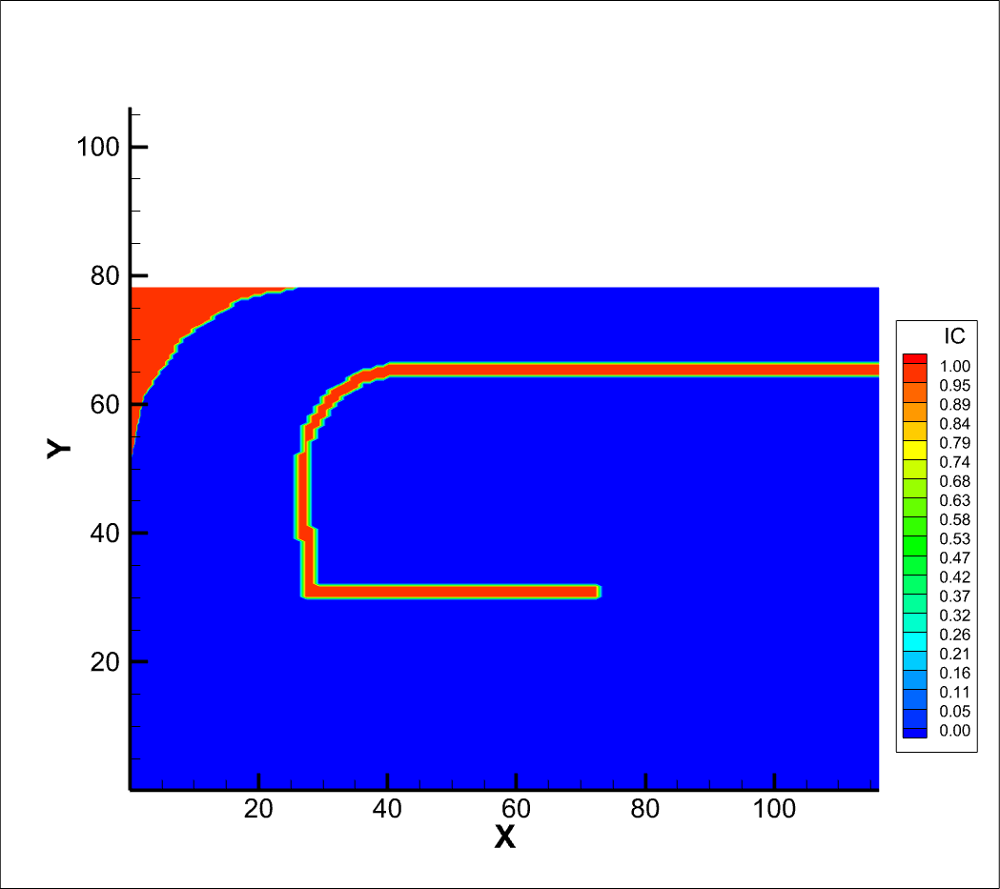

## Final Time (t=50s)
### Full Graphs
| Partially Open (H=20ft) Config. | Fully Open (H=64ft) Config. |
|--------------|-------------|
| 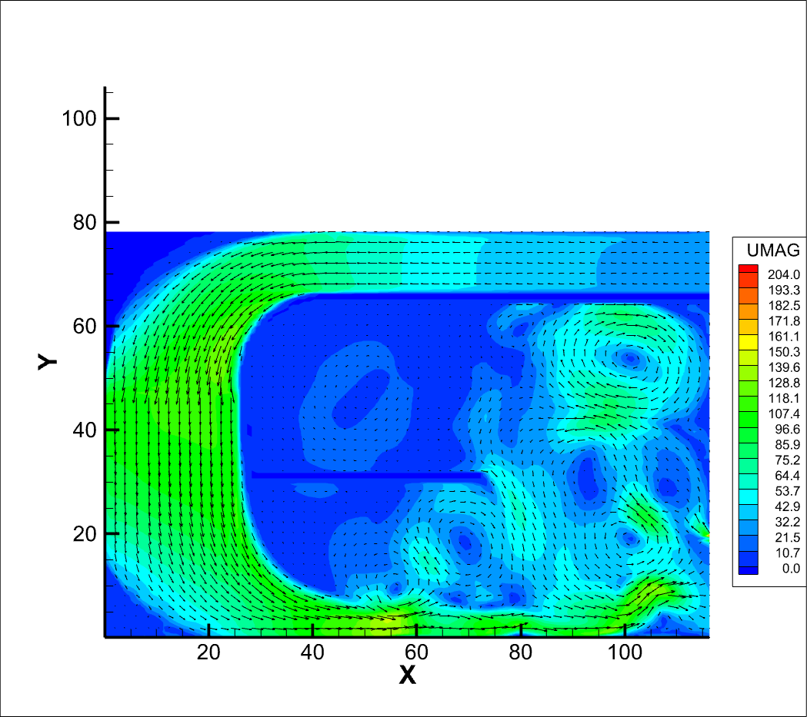    _data source: data/outlet-v1/axad-p.plt_ | 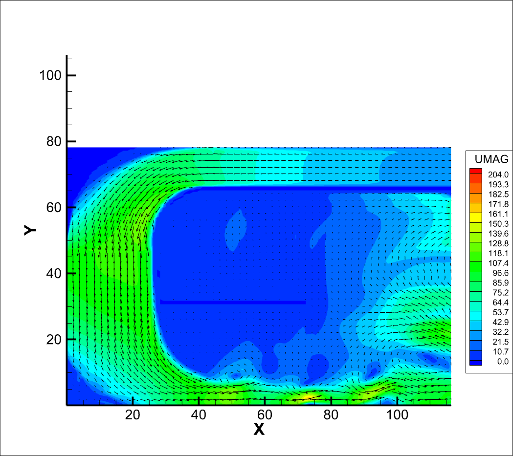     _data source: data/outlet-v2/axad-p.plt_ |

### Legend Only
|  UMAG (ft/sec)   |
|---|

## Averaged (20s<t<50s)
### Full Graphs
| Partially Open (H=20ft) Config. | Fully Open (H=64ft) Config. |
|--------------|-------------|
| 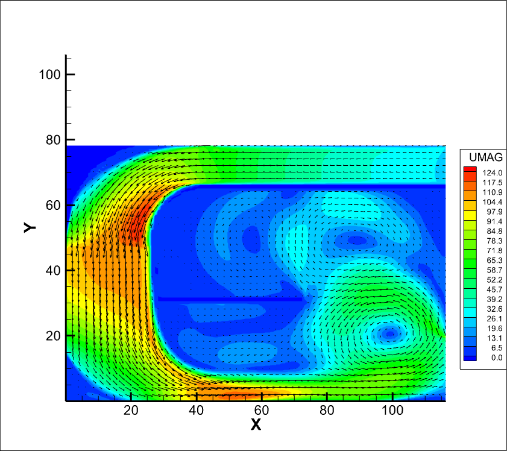    _data source: data/outlet-v1/axad-pa.plt_ | 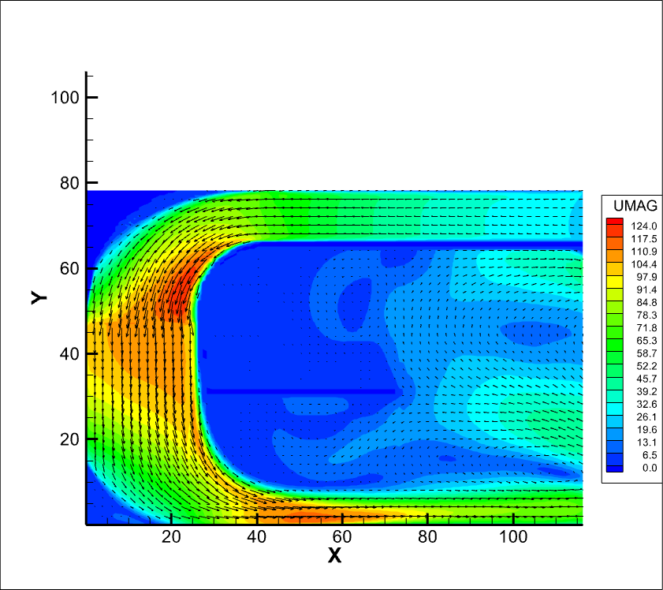     _data source: data/outlet-v2/axad-pa.plt_ |

### Legend Only
|  UMAG (ft/sec) 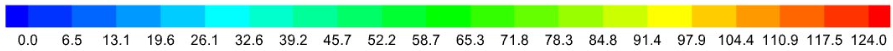  |
|---|

## Max. Horizontal Velocity Comparisons (0<t<50s)

### Animation
(put animation here)

### Magnitude over Time
(put side by side comparison of just the magnitude of MHV over time)

### X Coordinate Positions over Time
(put side by side comparison of just the x-coord of MHV over time)

### Z Coordinate Positions over Time
(put side by side comparison of just the z-coord of MHV over time)

# Pressure Graphs

## Final Time (t=50s)
### Full Graphs
| Partially Open (H=20ft) Config. | Fully Open (H=64ft) Config. |
|--------------|-------------|
| 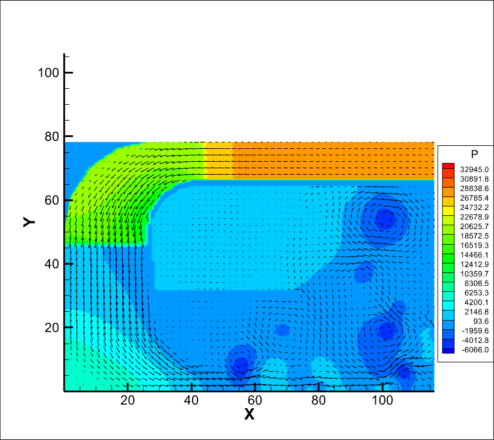    _data source: data/outlet-v1/axad-p.plt_ | 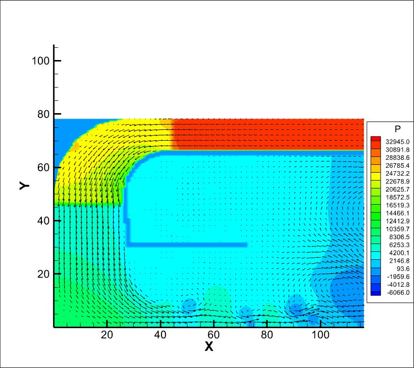     _data source: data/outlet-v2/axad-p.plt_ |

### Legend Only (Horizontal)
|  P (ft2/sec2)   |
|---|

## Averaged (20s<t<50s)
### Full Graphs
| Partially Open (H=20ft) Config. | Fully Open (H=64ft) Config. |
|--------------|-------------|
| 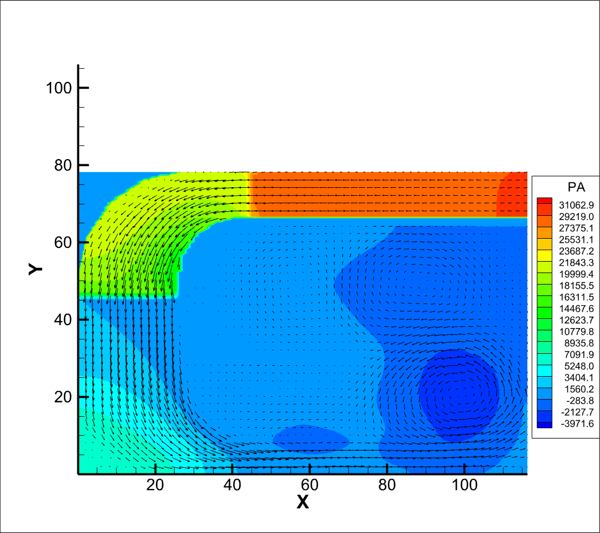    _data source: data/outlet-v1/axad-pa.plt_ | 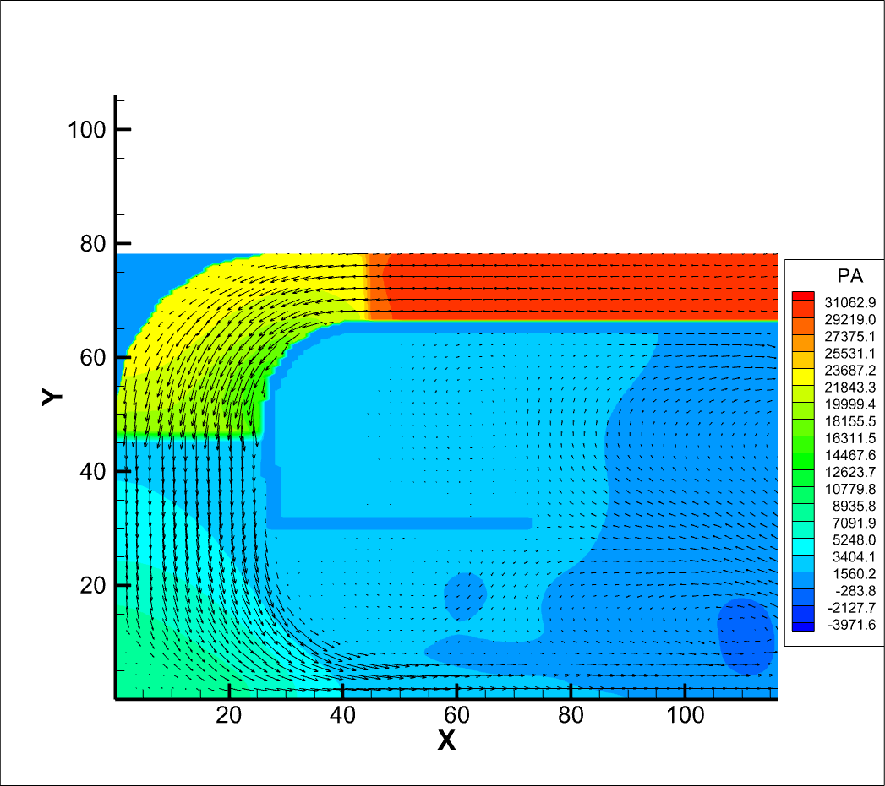     _data source: data/outlet-v2/axad-pa.plt_ |

### Legend Only (Horizontal)
|  PA (ft2/sec2) 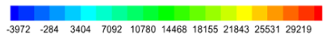  |
|---|

## Ground (20s<t<50s)
### Full Graphs
| Partially Open (H=20ft) Config. | Fully Open (H=64ft) Config. |
|--------------|-------------|
| 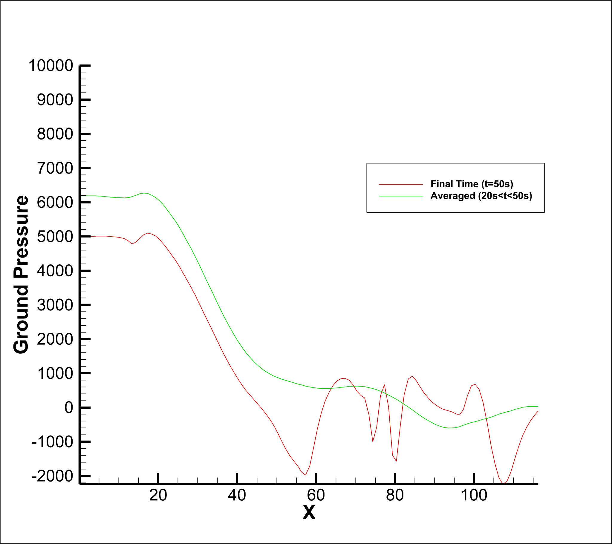    _data source: data/outlet-v1/axad-o.plt_ | 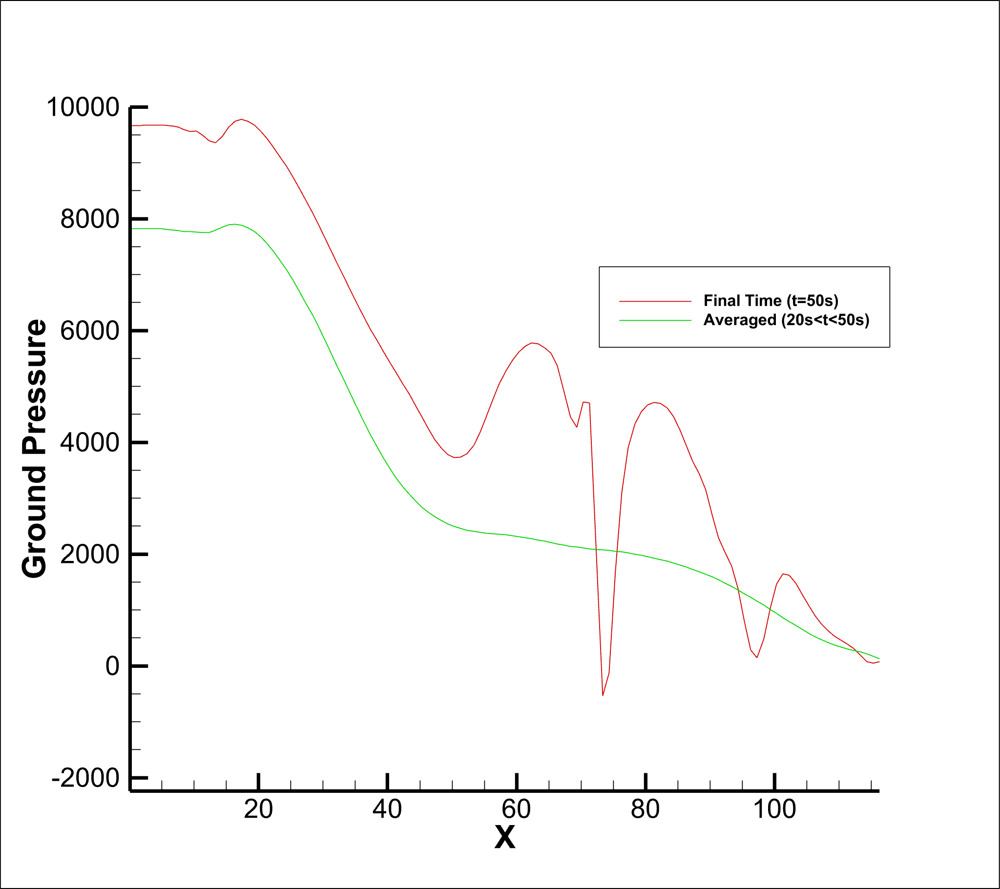     _data source: data/outlet-v2/axad-o.plt_ |

### Legend Only
|    |
|---|
