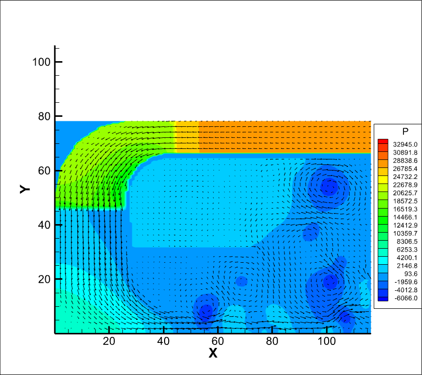
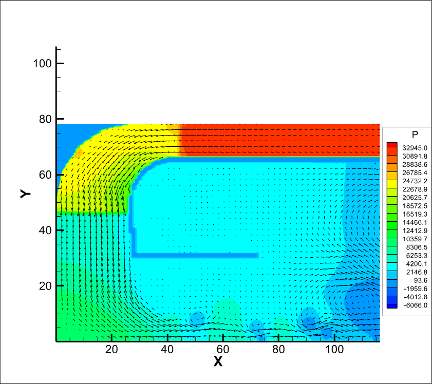
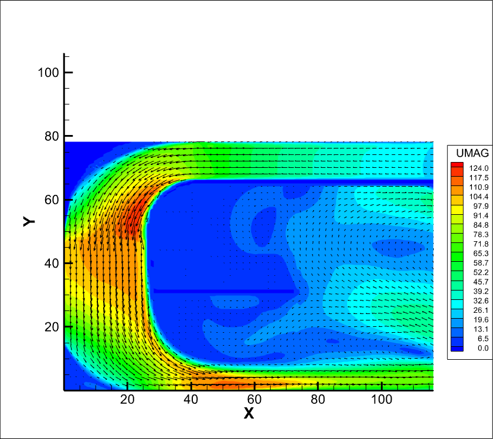

# Comparison of CFD Simulations for Closed vs. Open Systems

## AXAD-P
#### Data Statistics Table

| Metric       | Closed System (outlet-v1)  | Open System (outlet-v2)  |
|--------------|----------------------------|--------------------------|
| P_MIN        | -6066                      | -1652                    |
| P_MAX        | 28266                      | 32945                    |
| P_RANGE      | 29918                      | 28531                    |
| P_AVG        | 4375                       | 8063                     |
| UMAG_MIN     | 0                          | 0                        |
| UMAG_MAX     | 204                        | 166                      |
| UMAG_RANGE   | 204                        | 166                      |
| UMAG_AVG     | 42.36                      | 39.83                    |

#### Pressure Contours

| Closed System | Open System |
|--------------|-------------|
|     Closed version of Axad-p (outlet-v1/axad-p.plt) with pressure contours |     Open version of Axad-p (outlet-v2/axad-p.plt) with pressure contours |

#### UMAG Contours

| Closed System | Open System |
|--------------|-------------|
|     Closed version of Axad-p (outlet-v1/axad-p.plt) with UMAG contours |     Open version of Axad-p (outlet-v2/axad-p.plt) with pressure UMAG |

## AXAD-PA

#### UMAG Contours
| Closed System | Open System |
|--------------|-------------|
|     Closed version of Axad-pa (outlet-v1/axad-pa.plt) with UMAG contours |     Open version of Axad-pa (outlet-v2/axad-pa.plt) with UMAG contours |

